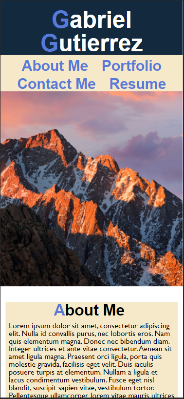

# MrG's Porfolio
## Homework Week 2: Portfolio Creation
===

## Description
This project consists a complete design of a working portfolio created using html and css elements.  The page is deployed live and created with responsive design in mind, to flow smoothly on both desktop and mobile viewing.  The links function correctly to jump to different sections of the webpage, and the work section is enhanced using css elements and psuedo elements to prominantly display the first project done as well as several follow up projects.  On hover, the elements grow in scale and glow around the border to directly show which element is chosen.  The page collapses to a column view once a certain screen width is detected to adapt for a smoother mobile experience. 

### Note, dummy information is included that will be substituted with actual contact information and work at a later date.

## Screenshot
Here you can find a mockup screenshot of the webpage, displaying the responsive design collapsing of the elements on the page.

---

## URL
Web page can be located at [Gitpages](https://mrg105.github.io/MrG-Portfolio/ "Web Development Portfolio - Mr.G")

## Repo
Repository can be located at [Github](https://github.com/MrG105/MrG-Portfolio "Github")

## Contact
Refactoring and Repo updated by Gabriel Gutierrez.  [email](poo328@my.utsa.edu "email")